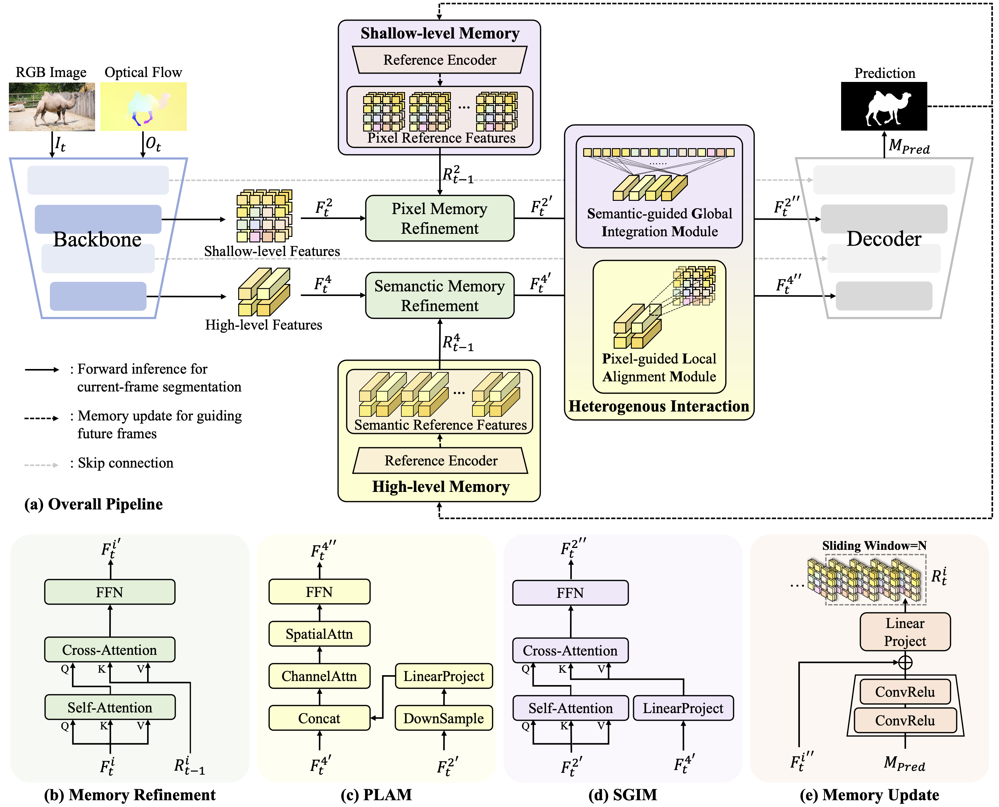

# 🔍 (ACM MM 25) Shallow Features Matter: Hierarchical Memory with Heterogeneous Interaction for Unsupervised Video Object Segmentation

[](https://acmmm.org/2025/)
[](./LICENSE)

Official code repository for our **ACM MM 2025** paper:

> **"Shallow Features Matter: Hierarchical Memory with Heterogeneous Interaction for Unsupervised Video Object Segmentation"**  
> Xiangyu Zheng, Songcheng He, Wanyu Li, Xiaoqiang Li, Wei Zhang 
> 🔗 [[Paper Link](./HMHI-Net.pdf)] 

---

## 📖 Introduction

This repository provides the official implementation of our ACM MM 2025 paper, **"Shallow Features Matter: Hierarchical Memory with Heterogeneous Interaction for Unsupervised Video Object Segmentation"** 🔗 [[Paper Link](./HMHI-Net.pdf)] . 

In this work, we propose a novel method **HMHI-Net** for **Unsupervised Video Object Segmentation (UVOS) with Shallow Features for Memroy**. The method features:

- 🔧 A novel **Hierarchical Memory Architecture** that simultaneously incorporates shallow- and high-level features for memory, facilitating UVOS with both pixel-level details and semantic richness stored in memory banks.
- 🔁 The **Heterogeneous Mutual Refinement Mechanism** to perform interaction across two memory banks, through the pixel-guided local alignment module (PLAM) and the semantic-guided global integration module (SGIM) respectively.
- ⚡ HMHI-Net achieves **SOTA** on common UVOS and VSOD benchmarks, with **89.8% J&F** on DAVIS-16, **86.9% J on FBMS** and **76.2% J** on YouTube-Objetcs.

<div align="center">
  
  <br>
  <em>(a) Overall pipeline of HMHI-Net. (b) Memory readout mechanism to refine current frame. (c) Pixel-guided local alignment module. (d)Semantic-guided global integration module. (e) Memory update mechanism with the reference encoder.</em>
</div>

---

## 🎞️ Video Demo

<!-- <div align="center">
  <video src="assets/demo.mp4" width="80%" controls></video>
  <br>
  <em>Qualitative results on benchmark datasets. More visualizations can be found in the <a href="https://your-video-link.com">video demo</a>.</em>
</div> -->

|Demo1|Demo2|
|-----|-----|
|  |  |
| **Car-roundabout_Davis16** | **Dog_Davis16** |

|Demo3|Demo4|
|-----|-----|
|  |  |
| **Drift-straight_Davis16** | **Parkour_Davis16** |


<!-- 
  
   -->
</p>


---

## 🚀 Getting Started

### 1. Environment Setup

```bash
pip install -r requirements.txt
```
### 2. Data Preparation

#### ▶️ Dataset Download

| Dataset         | Download Link                              |
| ----------------| --------------------------------------- |
| YouTube-VOS     | [🔗 Download](https://drive.google.com/file/d/1gIjDufaPzYGIYYsF39n_8KdkDkwiWDh3/view?usp=drive_link) |
| DAVIS-16        | [🔗 Download](https://drive.google.com/file/d/1z8YXAOXS-eKFpi6SaHAgmMMTEo_7VFsr/view?usp=drive_link) |
| FBMS            | [🔗 Download](https://drive.google.com/file/d/1TNsosG-fxk_wA_vNURRm5ch1u2SEAJAs/view?usp=drive_link) |
| Youtube-Objects | [🔗 Download](https://drive.google.com/file/d/1dIK3IGZhINc1Cbv1i8Scx01558CSbjRl/view?usp=drive_link) |
| DAVSOD          | [🔗 Download](https://drive.google.com/file/d/1MHRmzFdsk4g9AM2fiYA9HaRH02W_8C44/view?usp=drive_link) |
| ViSal           | [🔗 Download](https://drive.google.com/file/d/16TvwWj9EtdnNyE5qok0b1ta_1mFNSW5d/view?usp=drive_link) |

Please Ensure to organize the data files as follows:
```bash
data/
  └── DAVIS-16/
        ├── Images/
        |   ├── train/
        |   |   ├── video_name1/
        |   |   ├── video_name2/
        |   |    ...
        |   └── val/
        |       ├── video_name1/
        |       ├── video_name2/
        |       ...
        ├── Annotations/
        |   ├── train/
        |   |   ├── video_name1/
        |   |   ├── video_name2/
        |   |    ...
        |   └── val/
        |       ├── video_name1/
        |       ├── video_name2/
        |       ...
        └── Flows/
        |   ├── train/
        |   |   ├── video_name1/
        |   |   ├── video_name2/
        |   |    ...
        |   └── val/
        |       ├── video_name1/
        |       ├── video_name2/
        |        ...
              
  └── Youtube-VOS/
        ├── Images/
            ...
        ├── Annotations/
            ...
        └── Flows/
            ...
...
```
#### ▶️ Download Pretrained Model

Download the pretrained model and save them in './checkpoint/pretrained/' for model training.

| Pretrained Model        | Model Link                              |
| ----------------| --------------------------------------- |
| [🔗 Segformer (NeurIPS 21)](https://arxiv.org/abs/2105.15203)     | [🔗 Mit_b0 - Mit_b5](https://github.com/open-mmlab/mmsegmentation/tree/master/configs/segformer#usage) |
| [🔗 Swin-Transformer (ICCV 21)](https://arxiv.org/abs/2103.14030)       | [🔗 Swin-T - Swin-B](https://github.com/SwinTransformer/Swin-Transformer-Semantic-Segmentation) |

#### ▶️ Download HMHI-Net Checkpoints
| Task          | Download Link                 |
| -----------   | ----------------------------- |
|               | [🔗 DAVIS-16](https://drive.google.com/file/d/1JnXgrxO_pRrudRQEN78QRdLP2apJGWjB/view?usp=drive_link) |
|   UVOS  Checkpoints     | [🔗 FBMS](https://drive.google.com/file/d/1dV21oP8LzfJAjp5lMthsih-NLOSm236z/view?usp=drive_link) |
|               | [🔗 Youtube-Objects](https://drive.google.com/file/d/1OG_Dla9f-sBuoi3Q6mF55Au3rU-Fc9Sg/view?usp=drive_link) |
|               |                                |
|               | [🔗 DAVIS-16](https://drive.google.com/file/d/1OFwxuYPA5RuaoNfkX-Jgay6dqaE6GywM/view?usp=drive_link) |
|   VSOD  Checkpoints     | [🔗 DAVSOD](https://drive.google.com/file/d/1t9JGSMs27t-DHO0dN3fgA7NxYak6zpkK/view?usp=drive_link) |
|               | [🔗 FBMS](https://drive.google.com/file/d/13pkJbYTsaA1nIztfisNrjalgkQTXF6mn/view?usp=drive_link) |
|               | [🔗 ViSal](https://drive.google.com/file/d/1dqItvX0A1PN88LxX10j18rgik1jvLjmU/view?usp=drive_link) |


### 3. Training
```bash
# Certain config values in the file may require modification to suit your local setup.
bash scripts/train.sh
```

### 4. Fine-Tuning
```bash
# Certain config values in the file may require modification to suit your local setup.
bash scripts/finetune.sh
```

### 5. Inference
```bash
# Certain config values in the file may require modification to suit your local setup.
bash scripts/infer.sh
```

### 6. Evaluation
```Python
# Certain config values in the file may require modification to suit your local setup.

# For UVOS tasks
python utils/val_zvos.py

# For VSOD tasks
python utils/val_vsod.py
```

## Acknowledgement

This repository is built upon [[🔗 Isomer](https://github.com/DLUT-yyc/Isomer/)] and [[🔗 SAM](https://github.com/facebookresearch/segment-anything)], originally proposed in:

1. "Isomer: Isomerous Transformer for Zero-Shot Video Object Segmentation",
Yichen Yuan, Yifan Wang, Lijun Wang, Xiaoqi Zhao, Huchuan Lu, Yu Wang, Weibo Su, Lei Zhang
ICCV, 2023. [[🔗 Paper](https://arxiv.org/abs/2308.06693)]

2. "Segment Anything"
Alexander Kirillov, Eric Mintun, Nikhila Ravi, Hanzi Mao, Chloe Rolland, Laura Gustafson, Tete Xiao, Spencer Whitehead, Alex Berg, Wan-Yen Lo, Piotr Dollar, Ross Girshick, arxiv, 2023.
[[🔗 Paper](https://arxiv.org/abs/2304.02643)]

We reuse parts of their codebase, including:

- The data loading pipeline

- Model initialization logic

- Training routines

- Module formulation

## License
The model is licensed under the [Apache 2.0 license](./LICENSE).

## Citating HMHI-Net
```bibtext
@inproceedings{Zheng2025mm,
  title     = {Shallow Features Matter: Hierarchical Memory with Heterogeneous Interaction for Unsupervised Video Object Segmentation},
  author    = {Xiangyu Zheng, Songcheng He, Wanyu Li, Xiaoqiang Li, Wei Zhang},
  booktitle = {Proceedings of the ACM International Conference on Multimedia (ACM MM)},
  year      = {2025}
}
```


